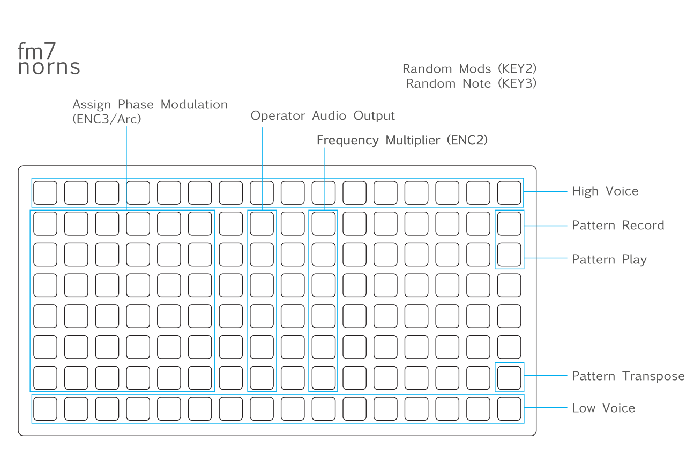

# FM7 - A Polyphonic Synthesizer for Norns With 6 Operator Frequency Modulation

Plug in a MIDI controller or a Monome Arid and off you go. Check parameters menu for all the things you can change. Modular possibilities expanded with Monome Arc. The phrase frequency modulation and phase modulation are equivilent. The docs use the term phase modulation because that's what the engine uses.

[Video example](https://youtu.be/HI9B-vuWF4A)



### Requirements

Nothing required to hear sound but if you want to do something more than play random notes, you will need a MIDI instrument or a Monome grid.

### Documentation
```
-- FM7 Polyphonic Synthesizer
-- With 6 Operator Frequency 
-- Modulation
-- ///////////////////////////
-- key 2: random phase mods
-- key 3: play a random note
-- ///////////////////////////
-- grid pattern player:
-- 1-16 1 high voice
-- 1-16 8 low voice
-- 16 2 pattern record toggle
-- 16 3 pattern play toggle
-- 16 7 pattern transpose mode
-- ///////////////////////////
-- 1-6 2-7 phase mod matrix
-- 8 2-7 operator audio output
-- 10 2-7 frequency multiplier
-- (enables ENC2 control)
-- ///////////////////////////
-- Arc encoders are assigned 
-- when phase mod toggled.
-- Without an arc, ENC3 is 
-- phase mod controller

```

## Future plans

* Envelope editing via UI
* Add LFOs
* More Arc features
* Envelopes respond to MIDI velocity
